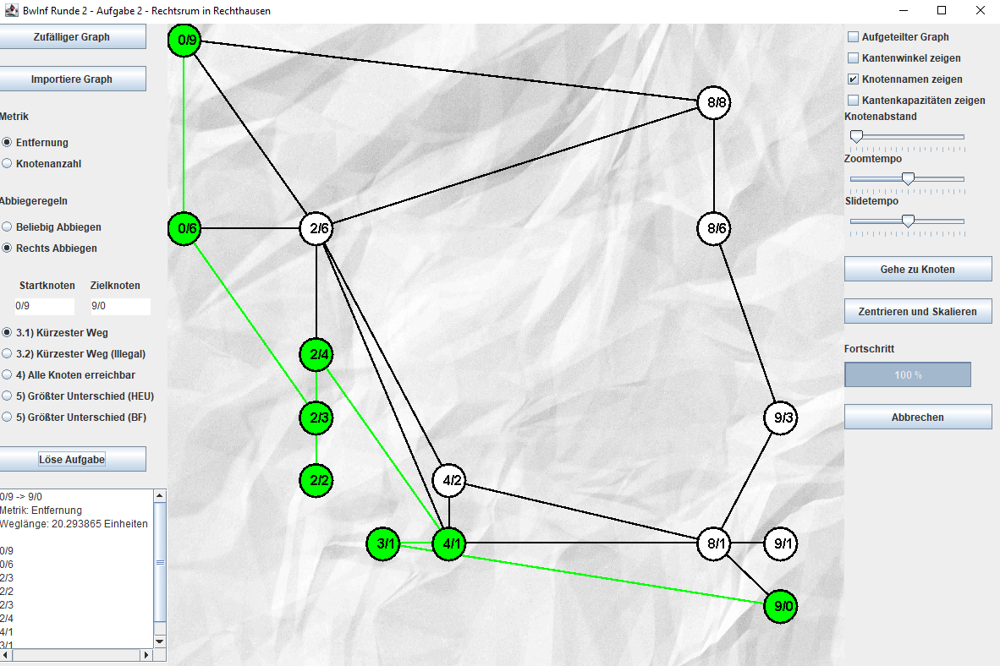

# Rechtsrum-in-Rechtshausen
My submission for the exercise **Rechtsrum in Rechtshausen** of the 35th [**Bundeswettbewerb Informatik**](https://bwinf.de/bundeswettbewerb/) in 2016/17.

The detailed task description can be found in **Aufgabenstellung.pdf** which in sum was to devise an efficient algorithm
to find the shortest path on a grid graph with the restriction that no left turns are allowed. 

**Dokumentation.pdf** contains the full documentation of the solution as well as a
manual on how to operate the GUI **Rechtsrum_in_Rechtshausen.jar** which makes it possible to manually run all components of the solution.
The following shows the GUI:

  

The jar **Rechtsrum_in_Rechtshausen.jar** was compiled with Java compiler version 7 (51.0) and example graphs to run the 
algorithm on can be found in the folder **graphs**.
